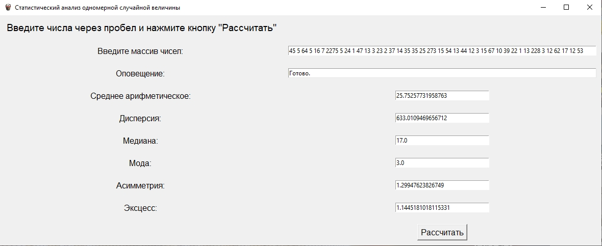

# python
statistical_analysis - программа для статистического анализа одномерной случайной величины. Она парсит вставленную строку, находит в ней числа и производит вычисления. Если не вставлено, как минимум, два числа, программа выводит ошибку в пункт "Оповещение".

